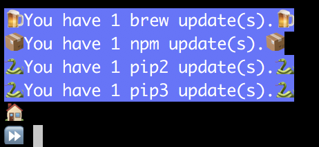

# fancy-prompt
A Very Fancy Bash Prompt 🎩



# Installation

Clone this repository.

Assuming you clone it into `~/bin/fancy-prompt`:

* Add to your `~/.bash_profile`: `source ~/bin/fancy-prompt`
* Add the following to cron, using `crontab -e`

```

PATH=/bin:/sbin:/usr/bin:/usr/sbin:/usr/local/sbin:/usr/local/bin

@hourly date >> /tmp/.pack-update-log && /Users/joedeveloper/bin/fancy-prompt/outdated-packages.sh >> /tmp/.pack-update-log
@reboot date >> /tmp/.pack-update-log && /Users/joedeveloper/bin/fancy-prompt/outdated-packages.sh >> /tmp/.pack-update-log
@daily mv /tmp/.pack-update-log /tmp/.pack-update-log.yesterday && touch /tmp/.pack-update-log

```

Profit!
